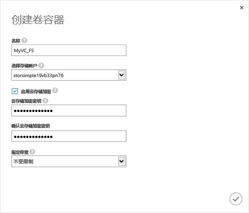

<!--author=SharS last changed: 9/17/15-->

#### 若要创建卷容器
1. 设备中**快速启动**页上，单击**添加卷容器**。 **创建卷容器**对话框随即出现。
   
    
2. 在**创建卷容器**对话框中：
   
   1. 提供**名称**为卷容器。 名称必须是 3 到 32 个字符长。
   2. 选择**存储帐户**要与此卷容器关联。 你可以选择在创建服务时生成的默认帐户。 你还可以使用**添加新**选项以指定未链接到此服务订阅的存储帐户。
   3. 选择**启用云存储加密**若要启用从设备发送到云的数据的加密。
   4. 提供并确认**云存储加密密钥**，它是 8 至 32 个字符长。 此密钥由设备用于访问加密的数据。
   5. 选择**无限制**中**指定带宽**下拉列表，如果你想要使用所有可用的带宽。 此外可以将此选项设置为**自定义**进行带宽控制，并指定介于 1 到 1,000 Mbps 之间的值。 
      如果你有你可用的带宽使用情况信息，你可以通过指定根据计划分配带宽**选择带宽模板**。 有关分步过程，请转到[添加带宽模板](../articles/storsimple/storsimple-manage-bandwidth-templates.md#add-a-bandwidth-template)。
   6. 单击复选图标  若要保存此卷容器并退出向导。 
   
   上会列出新创建的卷容器**卷容器**页。

**可用的视频**

若要观看的视频，演示如何在 StorSimple 解决方案中创建卷容器，请单击[此处](https://azure.microsoft.com/documentation/videos/create-a-volume-container-in-your-storsimple-solution/)。

