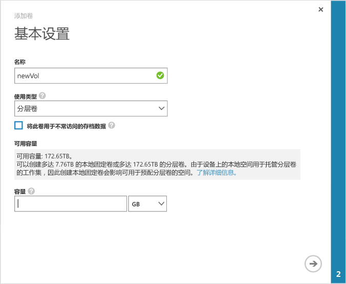

<!--author=alkohli last changed: 08/16/2016-->

#### 创建卷
1. 在设备的“快速启动”页上，单击“添加卷”，启动“添加卷”向导。
2. 在“添加卷”向导中的“基本设置” 下，执行以下操作：
   
   1. 键入卷的“名称”  。
   2. 在下拉列表中，选择卷的“使用类型”  。 对于需要本地保证、低延迟和高性能的工作负荷，请选择“本地固定”  卷。 对于所有其他数据，请选择“分层”  卷。 如果将此卷用于存档数据，请选中“将此卷用于不常访问的存档数据” 。 
      
       本地固定卷充分预配，可确保卷上的主数据保留在设备本地，未溢出到云端。  如果创建一个本地固定卷，设备会检查本地层上的可用空间，预配所请求大小的卷。 创建本地固定卷的过程中，设备中的现有数据可能会溢出到云端，因此创建该卷所花的时间可能会很长。 总时间取决于预配卷的大小、可用的网络带宽以及设备中的数据。 
      
       分层卷精简预配，可快速创建。 为用于存档数据的分层卷选中“将此卷用于不常访问的存档数据”  ，会将卷的重复数据删除区块大小更改为 512 KB。 如果未选中此字段，则相应的分层卷使用的区块大小为 64 KB。 重复数据删除区块越大，设备将大型存档数据传输到云端的速度就越快。
   3. 指定卷的“预配容量”  。 根据选择的卷类型，记下可用的容量。 指定的卷大小不得超过可用空间。
      
       可以在 8100 设备上预配高达 8.5 TB 的本地固定卷，预配高达 200 TB 的分层卷。 8600 设备更大，可以预配高达 22.5 TB 的本地固定卷，预配高达 500 TB 的固定卷。 由于托管分层卷的工作集需要使用设备上的本地空间，创建本地固定卷自然会影响用于预配分层卷可用的空间。 因此，如果创建本地固定卷，用户创建分层卷可用的空间就会减少。 同样，如果创建分层卷，用于创建本地固定卷的可用空间也会减少。
      
       如果在 8100 设备预配 8.5 TB（允许的最大大小）的本地固定卷，则已用尽设备上的所有可用本地空间。 由于设备上没有本地空间可用于托管分层卷的工作集，因此从这一刻起将不能再创建任何分层卷。 现有分层卷也会影响可用的空间。 例如，如果 8100 设备上的分层卷已占用大约 106 TB 的空间，那么本地固定卷只有 4 TB 的空间可用。
      
       下图显示的是本地固定卷的“基本设置”  对话框。
      
        
      
       下图显示的是分层卷的“基本设置”  对话框。
      
        
   
   1. 单击箭头图标   转到下一页。
3. 在“其他设置”  对话框中，添加新的访问控制记录 (ACR)：
   
   1. 为你的 ACR 提供“名称”  。
   2. 在“iSCSI 发起程序名称” 下，提供 Windows 主机的 iSCSI 限定名称 (IQN)。 如果没有 IQN，请转到 [获取 Windows Server 主机的 IQN](#get-the-iqn-of-a-windows-server-host)。
   3. 在“默认备份此卷?”下，选中“启用”复选框。 默认备份会创建一个策略，该策略于每天 22:30（设备时间）执行并创建此卷的云快照。
      
      > [!NOTE]
      > 在此处启用备份后，将无法还原。 需要编辑卷才能修改此设置。
      > 
      > 
      
      
4. 单击勾号图标  。 使用指定的设置创建卷。

<!--HONumber=Nov16_HO2-->

