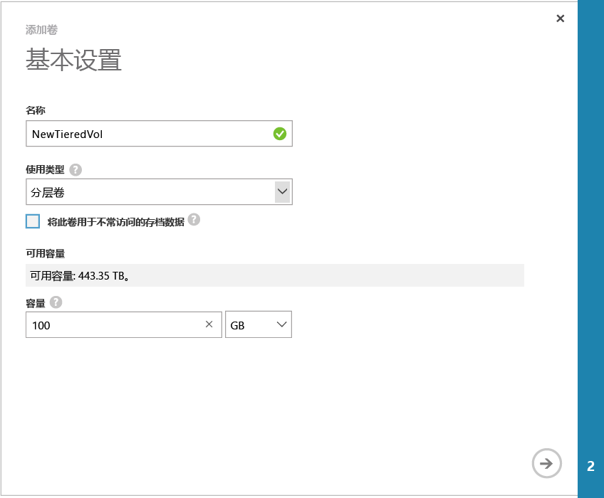

<!--author=SharS last changed: 02/04/2016-->

#### 创建卷

1. 在设备“快速启动”页上，单击“添加卷”。这将启动“添加卷向导”。

2. 在“添加卷向导”中的“基本设置”下，执行以下操作：
   1. 为卷提供“名称”。
   2. 指定卷的“预配的容量”（以 GB 或 TB 为单位）。对于物理设备，卷容量必须介于 1 GB 和 64 TB 之间。
   3. 在下拉列表上，选择卷的“使用类型”。
   4. 如果将此卷用于存档数据，请选中“将此卷用于不常访问的存档数据”复选框。对于所有其他使用情况，只需选择“分层卷”。（分层卷之前称为主卷）。

        

    4. 单击箭头图标  转到下一页。

3. 在“其他设置”对话框中，添加新的访问控制记录 (ACR)：
   1. 为你的 ACR 提供“名称”。
   2. 在“iSCSI 发起程序名称”下，提供 Windows 主机的 iSCSI 限定名称 (IQN)。如果没有 IQN，请转到[获取 Windows Server 主机的 IQN](#get-the-iqn-of-a-windows-server-host)。
   3. 我们建议通过选中“为此卷启用默认备份”复选框启用默认备份。默认备份将创建于每天 22:30（设备时间）执行的策略，并创建此卷的云快照。

        > [AZURE.NOTE] After the backup is enabled here, it cannot be reverted. You will need to edit the volume to modify this setting.

        

4. 单击选中图标 。使用指定设置创建卷。

 **可用视频**

若要观看如何创建 StorSimple 卷的演示视频，请单击[此处](https://azure.microsoft.com/documentation/videos/create-a-storsimple-volume/)。

<!---HONumber=AcomDC_0921_2016-->