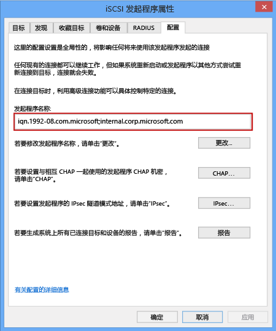

<!--author=SharS last changed: 9/17/15-->

#### 获取 Windows 主机的 IQN
1. 在 Windows 主机上启动 Microsoft iSCSI 发起程序。 依次单击“启动” > >“管理工具” > >“iSCSI 发起程序”。
2. 在“iSCSI 发起程序属性”窗口中的“配置”选项卡上，选择并复制“发起程序名称”字段中的字符串。
   
    
3. 保存此字符串。

