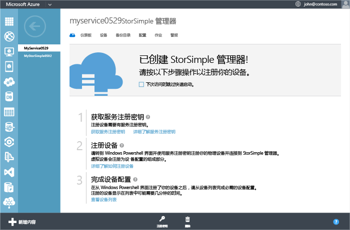
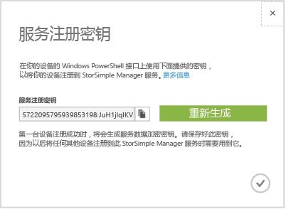

<!--author=alkohli last changed: 9/17/15-->

#### 若要获取 StorSimple 服务注册密钥
1. 上**StorSimple Manager 服务**页上，单击你创建的服务。 这将需要你**快速启动**页。 (你可以单击快速启动图标访问**快速启动**在任何时候的页。)
   
     
2. 单击**获取服务注册密钥**。 您也可以单击**注册密钥**位于页的底部。 你将需要等待几分钟，而检索到密钥。 **服务注册密钥**对话框随即出现。
   
     
3. 找到服务注册密钥。
4. 单击复制图标  若要复制的密钥，并将其保存以供将来使用。
5. 单击复选图标以关闭此对话框并返回到**快速启动**页。

> [!NOTE]
> 服务注册密钥用于注册需要使用你的 StorSimple Manager 服务注册的所有设备。
> 
> 

**可用的视频**

若要观看的视频，演示如何获取服务注册密钥，请单击[此处](https://azure.microsoft.com/documentation/videos/get-the-service-registration-key/)。

