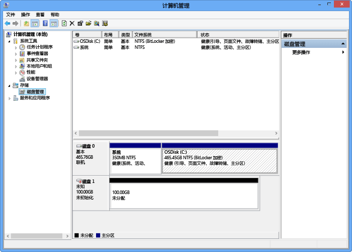

<!--author=SharS last changed: 9/17/15-->

#### 装载、初始化和格式化卷

1. 启动 Microsoft iSCSI 发起程序。

2. 在 **iSCSI 发起程序属性**窗口中的“**发现**”选项卡上，单击“**发现门户**”。

3. 在“**发现目标门户**”对话框中，提供支持 iSCSI 网络接口的 IP 地址，然后单击“**确定**”。

4. 在“**iSCSI 发起程序属性**”窗口中的“**目标**”选项卡上，找到“**发现目标**”。设备状态应显示为**非活动**。

5. 选择目标设备，然后单击“**连接**”。设备连接后，状态应更改为**已连接**。（有关使用 Microsoft iSCSI 发起程序的详细信息，请参阅[安装和配置 Microsoft iSCSI 发起程序][1]）。

6. 在 Windows 主机上，按 Windows 徽标键 + X，然后单击“**运行**”。

7. 在“**运行**”对话框中，键入 **Diskmgmt.msc**。单击“**确定**”，将出现“**磁盘管理**”对话框。右窗格中将显示在主机上的卷。

8. 在“**磁盘管理**”窗口中，已装载的卷将显示在以下所示的插图中。右键单击“发现的卷”（单击磁盘名称），然后单击“**联机**”。

     

9. 再次右键单击“发现的卷”（单击磁盘名称），然后单击“**初始化**”。

10. 若要格式化简单卷，请执行以下步骤：
  1. 选择卷并右键单击（单击右侧区域），然后单击“**新建简单卷**”。
  2. 在“新建简单卷”向导中，指定卷大小和驱动器号，并配置该卷为 NTFS 文件系统。
  3. 指定 64 KB 分配单元大小。此分配单元大小适用于 StorSimple 解决方案中使用的重复数据删除算法。
  4. 执行快速格式化。

 **可用视频**

若要观看演示如何装载、初始化和格式化 StorSimple 卷的视频，请单击[此处](https://azure.microsoft.com/documentation/videos/mount-initialize-and-format-a-storsimple-volume/)。

<!--Link references-->
[1]: https://technet.microsoft.com/library/ee338480(WS.10).aspx

<!---HONumber=AcomDC_0921_2016-->