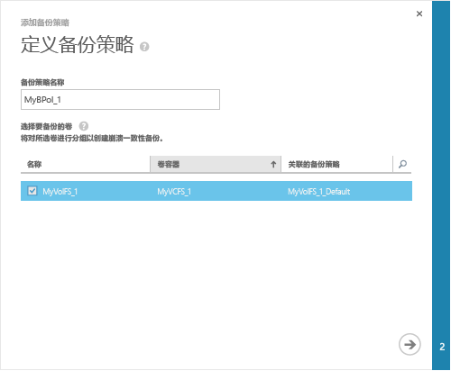
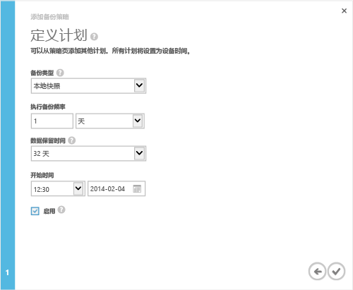

<!--author=alkohli last changed: 9/17/15-->

### 若要执行备份
1. 在设备上**快速启动**页上，单击**添加备份策略**。 这将启动添加备份策略向导。 
2. 上**定义备份策略**页：
   
   1. 提供包含你的备份策略的 3 至 150 个字符之间的名称。
   2. 选择要备份的卷。 如果你选择多个卷，这些卷将要分组一起以创建崩溃一致的备份。
   3. 单击箭头图标 。 
      
      
3. 上**定义计划**页：
   
   1. 从下拉列表中选择备份的类型。 恢复速度更快，选择**本地快照**。 实现数据弹性，选择**云快照**。
   2. 分钟、 小时、 天或周中指定的备份频率。
   3. 选择保留时间。 保留期选项取决于备份的频率。 例如，对于每日的策略，保留可以指定以周为单位，而每月的策略的保留期是在月中。
   4. 选择开始时间和日期以及备份策略。
   5. 选择**启用**复选框以启用备份策略。 
   6. 单击复选图标  若要保存策略。
      
      
      
      你已经将创建的卷数据的计划的备份的备份策略。

您已经完成设备配置。 

**可用的视频**

若要观看的视频，演示如何执行 StorSimple 备份，请单击[此处](https://azure.microsoft.com/documentation/videos/take-a-storsimple-backup/)。

