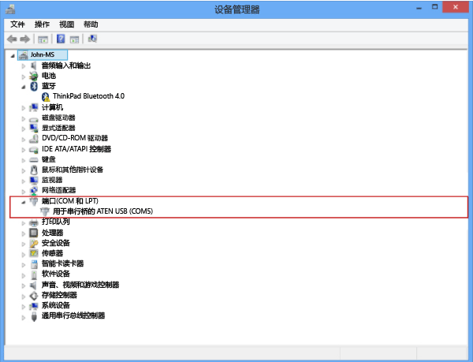
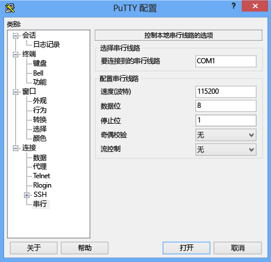

<!--author=SharS last changed: 9/17/15-->

#### 通过串行控制台进行连接
1. 将串行电缆连接到设备（直接连接或通过 USB 串行适配器连接）。
2. 打开“控制面板”，然后打开“设备管理器”。
3. 标识 COM 端口（如下图所示）。
   
     
4. 启动 PuTTY。
5. 在右侧窗格中，将“连接类型”更改为“串行”。
6. 在右侧窗格中，键入相应的 COM 端口。确保串行配置参数设置如下：
   
   * 速度：115,200
   * 数据位：8
   * 停止位：1
   * 奇偶校验：无
   * 流控制：无
     
     这些设置如下图所示。
     
     
     
     > [!NOTE]
     > 如果默认的流控制设置不起作用，请尝试将流控制设置为 XON/XOFF。
     > 
     > 
7. 单击“打开”启动串行会话。

<!---HONumber=AcomDC_0921_2016-->