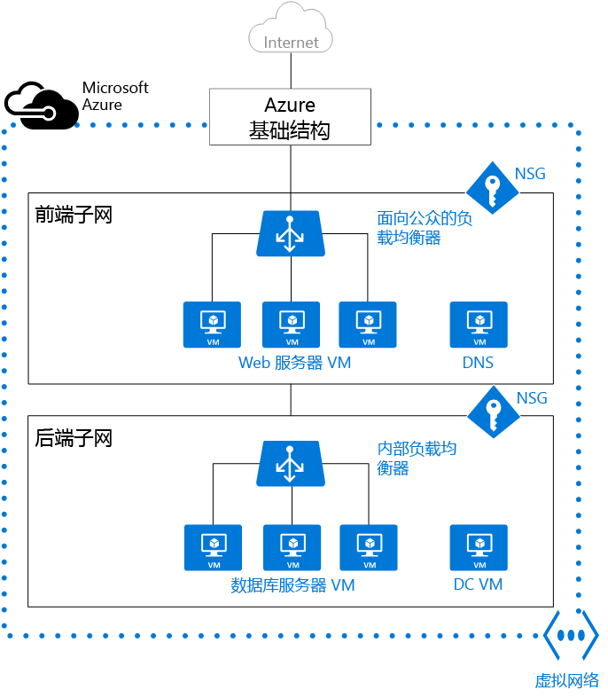

创建 Azure 虚拟机 (VM) 时，必须创建[虚拟网络](../articles/virtual-network/virtual-networks-overview.md) (VNet) 或使用现有的 VNet。 此外，还需要确定如何在 VNet 上访问 VM。 [在创建资源之前必须做好规划](../articles/virtual-network/virtual-network-vnet-plan-design-arm.md)，确保了解[网络资源的限制](../articles/azure-subscription-service-limits.md#networking-limits)。

在下图中，VM 显示为 Web 服务器和数据库服务器。 每组 VM 已分配到 VNet 中的独立子网。

可以在创建 VM 之前创建 VNet，也可以在创建 VM 时创建 VNet。 需要创建以下资源来支持与 VM 通信：

- 网络接口
- IP 地址
- 虚拟网络和子网

除了上述基本资源外，还应考虑创建以下可选资源：

- 网络安全组
- 负载均衡器 

## 网络接口

[网络接口 (NIC)](../articles/virtual-network/virtual-network-network-interface.md) 是 VM 与虚拟网络 (VNet) 之间互相连接的桥梁。 VM 必须至少有一个 NIC，但可以根据所创建 VM 的大小包含多个 NIC。 了解 [Windows](../articles/virtual-machines/windows/sizes.md) 或 [Linux](../articles/virtual-machines/linux/sizes.md) 的每个 VM 大小支持的 NIC 数。

可以创建具有多个 NIC 的 VM，并可在 VM 的整个生命周期中添加或删除 NIC。 多个 NIC 允许 VM 连接到不同子网，并可通过最适当的接口发送或接收流量。 详细了解如何在 [Windows](../articles/virtual-machines/windows/multiple-nics.md) 或 [Linux](../articles/virtual-machines/linux/multiple-nics.md) VM 中使用多个 NIC。

如果 VM 已添加到可用性集，该可用性集中的所有 VM 必须包含一个或多个 NIC。 包含多个 NIC 的 VM 不一定要有相同数目的 NIC，但必须至少包含两个 NIC。

附加到 VM 的每个 NIC 必须在与 VM 相同的位置和订阅中。 每个 NIC 必须连接到与 NIC 位于相同 Azure 位置和订阅中的 VNet。 创建 VM 之后，可以更改它连接到的子网，但无法更改 VNet。 附加到 VM 的每个 NIC 将分配有一个 MAC 地址，在删除 VM 之前，该地址不会变化。

下表列出了可用于创建网络接口的方法。

| 方法 | 说明 |
| ------ | ----------- |
| Azure 门户 | 在 Azure 门户中创建 VM 时，系统会自动创建网络接口（无法使用单独创建的 NIC）。 门户将创建只包含一个 NIC 的 VM。 如果想要创建包含多个 NIC 的 VM，必须使用其他方法创建 VM。 |
| [Azure PowerShell](../articles/virtual-network/virtual-network-deploy-multinic-arm-ps.md) | 结合 **-PublicIpAddressId** 参数使用 [New-AzureRmNetworkInterface](/powershell/module/azurerm.network/new-azurermnetworkinterface)，提供事先创建的公共 IP 地址标识符。 |
| [Azure CLI](../articles/virtual-network/virtual-network-deploy-multinic-arm-cli.md) | 若要提供事先创建的公共 IP 地址标识符，请结合 **--public-ip-address** 参数使用 [az network nic create](https://docs.microsoft.com/cli/azure/network/nic#create)。 |
| [模板](../articles/virtual-network/virtual-network-deploy-multinic-arm-template.md) | 参考 [Network Interface in a Virtual Network with Public IP Address](https://github.com/Azure/azure-quickstart-templates/tree/master/101-nic-publicip-dns-vnet)（虚拟网络中使用公共 IP 地址的网络接口），使用模板部署网络接口。 |

## IP 地址 

可将以下类型的 [IP 地址](../articles/virtual-network/virtual-network-ip-addresses-overview-arm.md)分配到 Azure 中的 NIC：

- **公共 IP 地址** - 用来与 Internet 以及未连接到 VNet 的其他 Azure 资源进行入站和出站通信（不提供网络地址转换 (NAT)）。 向 NIC 分配公共 IP 地址是可选操作。 公共 IP 地址会产生少许费用，并且每个订阅可使用的最大公共 IP 地址数目有限制。
- **专用 IP 地址** - 用于在 VNet、本地网络和 Internet 中通信（提供 NAT）。 必须至少将一个专用 IP 地址分配给 VM。 若要详细了解 Azure 中的 NAT，请阅读[了解 Azure 中的出站连接](../articles/load-balancer/load-balancer-outbound-connections.md)。

可将公共 IP 地址分配到 VM 或面向 Internet 的负载均衡器。 可将专用 IP 地址分配到 VM 和内部负载均衡器。 可以使用网络接口将 IP 地址分配给 VM。

将 IP 地址分配给资源有两种方法 - 动态或静态。 默认分配方法为动态，即，IP 地址不是在创建它时分配的， 而是在创建 VM 或启动已停止的 VM 时分配的。 停止或删除该 VM 时，会释放该 IP 地址。 

要确保 VM 的 IP 地址保持不变，可将分配方法显式设置为静态。 在这种情况下，IP 地址是即时分配的。 只有在删除该 VM 或将其分配方法更改为动态时，才会释放该地址。
    
下表列出了可用于创建 IP 地址的方法。

| 方法 | 说明 |
| ------ | ----------- |
| [Azure 门户](../articles/virtual-network/virtual-network-deploy-static-pip-arm-portal.md) | 默认情况下，公共 IP 地址是动态的，在停止或删除 VM 时，与这些公共 IP 地址关联的地址可能会更改。 为确保 VM 始终使用同一个公共 IP 地址，需创建静态公共 IP 地址。 默认情况下，门户会在创建 VM 时向 NIC 分配一个动态专用 IP 地址。 创建 VM 后，可将此 IP 地址更改为静态地址。|
| [Azure PowerShell](../articles/virtual-network/virtual-network-deploy-static-pip-arm-ps.md) | 结合值为 Dynamic 或 Static 的 **-AllocationMethod** 参数使用 [New-AzureRmPublicIpAddress](/powershell/module/azurerm.network/new-azurermpublicipaddress)。 |
| [Azure CLI](../articles/virtual-network/virtual-network-deploy-static-pip-arm-cli.md) | 结合值为 Dynamic 或 Static 的 **--allocation-method** 参数使用 [az network public-ip create](https://docs.microsoft.com/cli/azure/network/public-ip#create)。 |
| [模板](../articles/virtual-network/virtual-network-deploy-static-pip-arm-template.md) | 参考 [Network Interface in a Virtual Network with Public IP Address](https://github.com/Azure/azure-quickstart-templates/tree/master/101-nic-publicip-dns-vnet)（虚拟网络中使用公共 IP 地址的网络接口），使用模板部署公共 IP 地址。 |

创建公共 IP 地址后，可将它分配到 NIC，从而将它与 VM 相关联。

## 虚拟网络和子网

子网是 VNet 中的一系列 IP 地址。 可将一个 VNet 划分为多个子网，以便于组织和提高安全性。 VM 中的每个 NIC 连接到一个 VNet 中的一个子网。 连接到 VNet 中的子网（不管是相同的子网还是不同的子网）的 NIC 可以互相通信，不需任何额外的配置。

设置 VNet 时，需指定拓扑，包括可用的地址空间和子网。 如果 VNet 要连接到其他 VNet 或本地网络，则必须选择不重叠的地址范围。 这些 IP 地址是专用的，无法从 Internet 访问，这种限制在过去只适用于不可路由的 IP 地址，例如 10.0.0.0/8、172.16.0.0/12 或 192.168.0.0/16。 现在，Azure 将所有地址范围都视为只能在 VNet 内部、互连 VNet 内部以及从本地位置访问的专用 VNet IP 地址空间的一部分。 

如果内部网络由组织中的其他某人负责，在选择地址空间之前，请咨询该负责人。 确保 IP 地址范围不重叠。请告诉他们要使用的空间，以免他们尝试使用相同的 IP 地址范围。 

默认情况下，子网之间没有安全边界，因此，每个子网中的 VM 可以相互通信。 但是，可以设置网络安全组 (NSG) 来控制流入或流出子网以及 VM 的流量。 

下表列出了可用于创建 VNet 和子网的方法。 

| 方法 | 说明 |
| ------ | ----------- |
| [Azure 门户](../articles/virtual-network/virtual-networks-create-vnet-arm-pportal.md) | 如果要在创建 VM 时让 Azure 创建 VNet，VNet 的名称是包含 VNet 的资源组名称和 **-vnet** 的组合。 地址空间为 10.0.0.0/24，所需的子网名称为 **default**，子网地址范围为 10.0.0.0/24。 |
| [Azure PowerShell](../articles/virtual-network/virtual-networks-create-vnet-arm-ps.md) | 使用 [New-AzureRmVirtualNetworkSubnetConfig](https://docs.microsoft.com/powershell/resourcemanager/AzureRM.Network/v1.0.13/New-AzureRmVirtualNetworkSubnetConfig) 和 [New-AzureRmVirtualNetwork](https://docs.microsoft.com/powershell/resourcemanager/AzureRM.Network/v1.0.13/New-AzureRmVirtualNetwork) 可以创建子网与 VNet。 还可以使用 [Add-AzureRmVirtualNetworkSubnetConfig](/powershell/module/azurerm.network/add-azurermvirtualnetworksubnetconfig) 将子网添加到现有 VNet。 |
| [Azure CLI](../articles/virtual-network/virtual-networks-create-vnet-arm-cli.md) | 子网和 VNet 是同时创建的。 在 [az network vnet create](https://docs.microsoft.com/cli/azure/network/vnet#create) 后面提供 **--subnet-name** 参数并指定子网名称。 |
| [模板](../articles/virtual-network/virtual-networks-create-vnet-arm-template-click.md) | 创建 VNet 和子网的最简单方法是下载一个现有的模板（例如[包含两个子网的虚拟网络](https://github.com/Azure/azure-quickstart-templates/tree/master/101-vnet-two-subnets)），并根据需要对它进行修改。 |

## 网络安全组

[网络安全组 (NSG)](../articles/virtual-network/virtual-networks-nsg.md) 包含一系列访问控制列表 (ACL) 规则，这些规则可以允许或拒绝流向子网和/或 NIC 的网络流量。 NSG 可与子网或者已连接到子网的各个 NIC 相关联。 当 NSG 与某个子网相关联时，ACL 规则将应用到该子网中的所有 VM。 另外，可以通过将 NSG 直接关联到 NIC，对流向单个 NIC 的流量进行限制。

NSG 包含两种类型的规则：入站规则和出站规则。 在每组中，规则的优先级必须保持唯一。 每个规则包含以下属性：协议、源和目标端口范围、地址前缀、流量方向、优先级和访问类型。 

所有 NSG 都包含一组默认规则。 默认规则无法删除，但由于给它们分配的优先级最低，可以用创建的规则来重写它们。 

将 NSG 关联到 NIC 时，NSG 中的网络访问规则只会应用到该 NIC。 如果 NSG 已应用到包含多个 NIC 的 VM 中的单个 NIC，则它不会影响流向其他 NIC 的流量。 可将不同的 NSG 关联到 NIC（或 VM，具体取决于部署模型）以及 NIC 或 VM 绑定到的子网。 优先级是根据流量方向指定的。

规划 VM 和 VNet 时，请务必[规划](../articles/virtual-network/virtual-networks-nsg.md#planning) NSG。

下表列出了可用于创建网络安全组的方法。

| 方法 | 说明 |
| ------ | ----------- |
| [Azure 门户](../articles/virtual-network/virtual-networks-create-nsg-arm-pportal.md) | 在 Azure 门户中创建 VM 时，会自动创建 NSG 并将其关联到门户创建的 NIC。 NSG 的名称是 VM 名称和 **-nsg** 的组合。 此 NSG 包含一个入站规则，该规则的优先级为 1000，服务设置为 RDP，协议设置为 TCP，端口设置为 3389，操作设置为“允许”。 如果想要允许其他任何入站流量流向 VM，必须向 NSG 添加更多规则。 |
| [Azure PowerShell](../articles/virtual-network/virtual-networks-create-nsg-arm-ps.md) | 使用 [New-AzureRmNetworkSecurityRuleConfig](https://docs.microsoft.com/powershell/resourcemanager/AzureRM.Network/v1.0.13/New-AzureRmNetworkSecurityRuleConfig) 并提供所需的规则信息。 使用 [New-AzureRmNetworkSecurityGroup](https://docs.microsoft.com/powershell/resourcemanager/AzureRM.Network/v1.0.13/New-AzureRmNetworkSecurityGroup) 创建 NSG。 使用 [Set-AzureRmVirtualNetworkSubnetConfig](https://docs.microsoft.com/powershell/resourcemanager/AzureRM.Network/v1.0.13/Set-AzureRmVirtualNetworkSubnetConfig) 为子网配置 NSG。 使用 [Set-AzureRmVirtualNetwork](/powershell/module/azurerm.network/set-azurermvirtualnetwork) 将 NSG 添加到 VNet。 |
| [Azure CLI](../articles/virtual-network/virtual-networks-create-nsg-arm-cli.md) | 首先使用 [az network nsg create](https://docs.microsoft.com/cli/azure/network/nsg#create) 创建 NSG。 使用 [az network nsg rule create](https://docs.microsoft.com/cli/azure/network/nsg/rule#create) 向 NSG 添加规则。 使用 [az network vnet subnet update](https://docs.microsoft.com/en-us/cli/azure/network/vnet/subnet#update) 将 NSG 添加到子网。 |
| [模板](../articles/virtual-network/virtual-networks-create-nsg-arm-template.md) | 参考[创建网络安全组](https://github.com/Azure/azure-quickstart-templates/tree/master/101-security-group-create)，使用模板部署网络安全组。 |

## 负载均衡器

[Azure 负载均衡器](../articles/load-balancer/load-balancer-overview.md) 可提高应用程序的可用性和网络性能。 可以配置负载均衡器，[对传入 VM 的 Internet 流量进行均衡](../articles/load-balancer/load-balancer-internet-overview.md)，或者[对 VNet 中 VM 之间的流量进行均衡](../articles/load-balancer/load-balancer-internal-overview.md)。 负载均衡器还可以均衡跨界网络中本地计算机与 VM 之间的流量，或者将外部流量转发到特定的 VM。

负载均衡器可以映射负载均衡器中公共 IP 地址与端口之间的，以及 VM 中专用 IP 地址与端口之间的传入和传出流量。

创建负载均衡器时，还必须考虑以下配置要素：

- **前端 IP 配置** – 单个负载均衡器可包含一个或多个前端 IP 地址（也称为虚拟 IP，即 VIP）。 这些 IP 地址充当流量的入口。
- **后端地址池** – 与负载分配到的 NIC 关联的 IP 地址。
- **NAT 规则** – 定义入站流量如何流经前端 IP 并分配到后端 IP。
- **负载均衡器规则** – 将给定的前端 IP 和端口组合映射到一组后端 IP 地址和端口组合。 单个负载均衡器可拥有多个负载均衡规则。 每个规则都包含前端 IP 和端口，以及与 VM 关联的后端 IP 和端口。
- **[探测](../articles/load-balancer/load-balancer-custom-probe-overview.md)** - 监视 VM 的运行状况。 当探测无法响应时，负载均衡器会停止向状况不良的 VM 发送新连接。 现有连接不受影响，新连接将发送到状况良好的 VM。

下表列出了可用于创建面向 Internet 的负载均衡器的方法。

| 方法 | 说明 |
| ------ | ----------- |
| Azure 门户 | 目前无法使用 Azure 门户创建面向 Internet 的负载均衡器。 |
| [Azure PowerShell](../articles/load-balancer/load-balancer-get-started-internet-arm-ps.md) | 若要提供事先创建的公共 IP 地址标识符，请结合 **-PublicIpAddress** 参数使用 [New-AzureRmLoadBalancerFrontendIpConfig](https://docs.microsoft.com/powershell/resourcemanager/AzureRM.Network/v1.0.13/New-AzureRmLoadBalancerFrontendIpConfig)。 使用 [New-AzureRmLoadBalancerBackendAddressPoolConfig](https://docs.microsoft.com/powershell/resourcemanager/AzureRM.Network/v1.0.13/New-AzureRmLoadBalancerBackendAddressPoolConfig) 创建后端地址池的配置。 使用 [New-AzureRmLoadBalancerInboundNatRuleConfig](https://docs.microsoft.com/powershell/resourcemanager/AzureRM.Network/v1.0.13/New-AzureRmLoadBalancerInboundNatRuleConfig) 创建与前端 IP 配置关联的入站 NAT 规则。 使用 [New-AzureRmLoadBalancerProbeConfig](https://docs.microsoft.com/powershell/resourcemanager/AzureRM.Network/v1.0.13/New-AzureRmLoadBalancerProbeConfig) 创建所需的探测。 使用 [New-AzureRmLoadBalancerRuleConfig](https://docs.microsoft.com/powershell/resourcemanager/AzureRM.Network/v1.0.13/New-AzureRmLoadBalancerRuleConfig) 创建负载均衡器配置。 使用 [New-AzureRmLoadBalancer](/powershell/module/azurerm.network/new-azurermloadbalancer) 创建负载均衡器。|
| [Azure CLI](../articles/load-balancer/load-balancer-get-started-internet-arm-cli.md) | 使用 [az network lb create](https://docs.microsoft.com/cli/azure/network/lb#create) 创建初始负载均衡器配置。 使用 [az network lb frontend-ip create](https://docs.microsoft.com/cli/azure/network/lb/frontend-ip#create) 添加事先创建的公共 IP 地址。 使用 [az network lb address-pool create](https://docs.microsoft.com/cli/azure/network/lb/address-pool#create) 添加后端地址池的配置。 使用 [az network lb inbound-nat-rule create](https://docs.microsoft.com/cli/azure/network/lb/inbound-nat-rule#create) 添加 NAT 规则。 使用 [az network lb rule create](https://docs.microsoft.com/cli/azure/network/lb/rule#create) 添加负载均衡器规则。 使用 [az network lb probe create](https://docs.microsoft.com/cli/azure/network/lb/probe#create) 添加探测。 |
| [模板](../articles/load-balancer/load-balancer-get-started-internet-arm-template.md) | 参考[负载均衡器中的 2 个 VM，在 LB 上配置 NAT 规则](https://github.com/Azure/azure-quickstart-templates/tree/master/201-2-vms-loadbalancer-natrules)，使用模板部署负载均衡器。 |
    
下表列出了可用于创建内部负载均衡器的方法。

| 方法 | 说明 |
| ------ | ----------- |
| Azure 门户 | 目前无法使用 Azure 门户创建内部负载均衡器。 |
| [Azure PowerShell](../articles/load-balancer/load-balancer-get-started-ilb-arm-ps.md) | 若要提供网络子网中的专用 IP 地址，请结合 **-PrivateIpAddress** 参数使用 [New-AzureRmLoadBalancerFrontendIpConfig](https://docs.microsoft.com/powershell/resourcemanager/AzureRM.Network/v1.0.13/New-AzureRmLoadBalancerFrontendIpConfig)。 使用 [New-AzureRmLoadBalancerBackendAddressPoolConfig](https://docs.microsoft.com/powershell/resourcemanager/AzureRM.Network/v1.0.13/New-AzureRmLoadBalancerBackendAddressPoolConfig) 创建后端地址池的配置。 使用 [New-AzureRmLoadBalancerInboundNatRuleConfig](https://docs.microsoft.com/powershell/resourcemanager/AzureRM.Network/v1.0.13/New-AzureRmLoadBalancerInboundNatRuleConfig) 创建与前端 IP 配置关联的入站 NAT 规则。 使用 [New-AzureRmLoadBalancerProbeConfig](https://docs.microsoft.com/powershell/resourcemanager/AzureRM.Network/v1.0.13/New-AzureRmLoadBalancerProbeConfig) 创建所需的探测。 使用 [New-AzureRmLoadBalancerRuleConfig](https://docs.microsoft.com/powershell/resourcemanager/AzureRM.Network/v1.0.13/New-AzureRmLoadBalancerRuleConfig) 创建负载均衡器配置。 使用 [New-AzureRmLoadBalancer](/powershell/module/azurerm.network/new-azurermloadbalancer) 创建负载均衡器。|
| [Azure CLI](../articles/load-balancer/load-balancer-get-started-ilb-arm-cli.md) | 使用 [az network lb create](https://docs.microsoft.com/cli/azure/network/lb#create) 命令创建初始负载均衡器配置。 若要定义专用 IP 地址，请结合 **--private-ip-address** 参数使用 [az network lb frontend-ip create](https://docs.microsoft.com/cli/azure/network/lb/frontend-ip#create)。 使用 [az network lb address-pool create](https://docs.microsoft.com/cli/azure/network/lb/address-pool#create) 添加后端地址池的配置。 使用 [az network lb inbound-nat-rule create](https://docs.microsoft.com/cli/azure/network/lb/inbound-nat-rule#create) 添加 NAT 规则。 使用 [az network lb rule create](https://docs.microsoft.com/cli/azure/network/lb/rule#create) 添加负载均衡器规则。 使用 [az network lb probe create](https://docs.microsoft.com/cli/azure/network/lb/probe#create) 添加探测。|
| [模板](../articles/load-balancer/load-balancer-get-started-ilb-arm-template.md) | 参考[负载均衡器中的 2 个 VM，在 LB 上配置 NAT 规则](https://github.com/Azure/azure-quickstart-templates/tree/master/201-2-vms-internal-load-balancer)，使用模板部署负载均衡器。 |

## VM

可在同一 VNet 中创建 VM，VM 可以使用专用 IP 地址相互连接。 即使 VM 位于不同的子网中，它们也可以相互连接，无需配置网关或使用公共 IP 地址。 要将 VM 放入某个 VNet，请创建该 VNet，然后在每个 VM 时，将其分配到该 VNet 和子网。 在部署或启动期间，VM 将获取其网络设置。  

部署 VM 时，系统将为 VM 分配一个 IP 地址。 如果将多个 VM 部署到 VNet 或子网，则 VM 启动时，系统将为其分配 IP 地址。 动态 IP 地址 (DIP) 是与 VM 关联的内部 IP 地址。 可向 VM 分配静态 DIP。 如果分配静态 DIP，应考虑使用特定的子网，避免意外地重复使用另一个 VM 的静态 DIP。  

如果创建了一个 VM，事后又想要将它迁移到 VNet，做出这种配置更改并不是一个简单的过程。 在这种情况下，必须将 VM 重新部署到 VNet。 最简单的重新部署方法是删除该 VM（但不要删除其上附加的任何磁盘），并在 VNet 中使用原始磁盘重新创建 VM。 

下表列出了可用于在 VNet 中创建 VM 的方法。

| 方法 | 说明 |
| ------ | ----------- |
| [Azure 门户](../articles/virtual-machines/windows/quick-create-portal.md) | 使用前面所述的默认网络设置创建包含单个 NIC 的 VM。 若要创建包含多个 NIC 的 VM，必须使用其他方法。 |
| [Azure PowerShell](../articles/virtual-machines/windows/tutorial-manage-vm.md) | 使用 [Add-AzureRmVMNetworkInterface](/powershell/module/azurerm.compute/add-azurermvmnetworkinterface) 将事先创建的 NIC 添加到 VM 配置中。 |
| [Azure CLI](../articles/virtual-machines/linux/create-cli-complete.md) | 创建 VM 并将其连接到以单个步骤生成的 Vnet、子网和 NIC。 |
| [模板](../articles/virtual-machines/windows/ps-template.md) | 参考 [Very simple deployment of a Windows VM](https://github.com/Azure/azure-quickstart-templates/tree/master/101-vm-simple-windows)（非常简单的 Windows VM 部署），使用模板部署 VM。 |

## 后续步骤
有关如何为 VM 管理 Azure 虚拟网络的 VM 特定步骤，请参阅 [Windows](../articles/virtual-machines/windows/tutorial-virtual-network.md) 或 [Linux](../articles/virtual-machines/linux/tutorial-virtual-network.md) 教程。

还有关于如何对 VM 进行负载均衡以及如何创建适用于 [Windows](../articles/virtual-machines/windows/tutorial-load-balancer.md) 或 [Linux](../articles/virtual-machines/linux/tutorial-load-balancer.md) 的高度可用应用程序的教程。

- 了解如何配置[用户定义的路由和 IP 转发](../articles/virtual-network/virtual-networks-udr-overview.md)。 
- 了解如何配置 [VNet 到 VNet 连接](../articles/vpn-gateway/vpn-gateway-vnet-vnet-rm-ps.md)。
- 了解如何[排查路由问题](../articles/virtual-network/virtual-network-routes-troubleshoot-portal.md)。