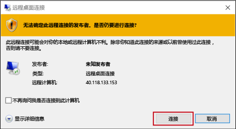
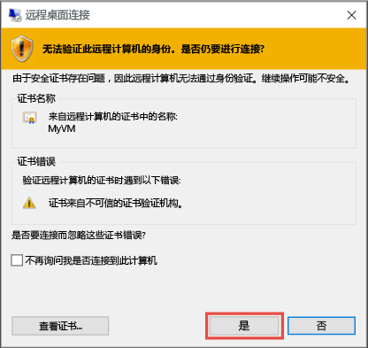

1. 单击**连接**创建和下载远程桌面协议文件 （.rdp 文件）。 单击**打开**要使用该文件。
2. 你将收到.rdp 来自未知发布服务器是一个警告。 这是正常的。 在远程桌面窗口中，单击**连接**以继续。
   
    
3. 在**Windows 安全性**窗口中，键入虚拟机上的帐户的凭据，然后单击**确定**。
   
     **本地帐户**-这通常是本地帐户用户名称和虚拟机的创建时指定的密码。 在这种情况下，域为虚拟机的名称和作为输入*vmname*&#92;*用户名*。  
   
    **已加入域的 VM** -如果虚拟机属于的域，以格式输入用户名*域*&#92;*用户名*。 帐户还需要或者是管理员组中，或者已授予给 VM 的远程访问权限。
   
    **域控制器**-如果 VM 是域控制器中，键入用户名和域的域管理员帐户的密码。
4. 单击**是**以验证虚拟机的标识并完成登录。
   
   

