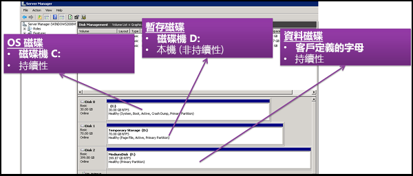
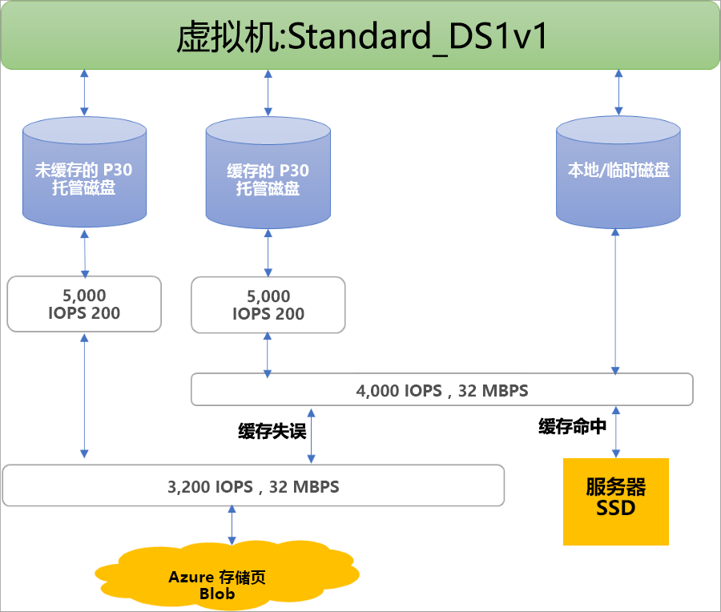

## 托管磁盘的好处

接下来让我们看一下使用托管磁盘可以获得的一些好处。

### 高度持久和可用

托管磁盘具备 99.999% 的可用性。 托管磁盘实现这一点的方式是：提供三个包含数据的副本，确保高持久性。 如果其中一个或两个副本出现问题，剩下的副本能够确保数据的持久性和对故障的高耐受性。 此架构有助于 Azure 为基础结构即服务 (IaaS) 磁盘持续提供企业级的持久性，年化故障率为 0%，达到行业领先水平。

### 简单且可缩放的 VM 部署

托管磁盘支持在每个区域中的一个订阅中创建最多 50,000 个同一类型的 VM 磁盘  ，这样就可以在单个订阅中创建数以千计的 VM  。 此功能允许使用 Marketplace 映像，在一个虚拟机规模集中创建多达 1000 台 VM，进一步增加[虚拟机规模集](../articles/virtual-machine-scale-sets/virtual-machine-scale-sets-overview.md)的可伸缩性。

### 集成可用性集

托管磁盘集成可用性集，可确保[可用性集中的 VM](../articles/virtual-machines/windows/manage-availability.md#use-managed-disks-for-vms-in-an-availability-set) 的磁盘彼此之间完全隔离以避免单点故障。 磁盘自动放置于不同的存储缩放单元（模块）。 如果某个模块因硬件或软件故障而失败，则只有其磁盘在该模块上的 VM 实例会失败。 例如，假定某个应用程序在 5 台 VM 上运行并且这些 VM 位于一个可用性集中。 这些 VM 的磁盘不会存储在同一个模块中，因此，如果一个模块失败，该应用程序的其他实例可以继续运行。

### 与可用性区域集成

托管磁盘支持[可用性区域](../articles/availability-zones/az-overview.md)，这是一种高可用性产品/服务，可以保护应用程序免受数据中心故障的影响。 可用性区域是 Azure 区域中独特的物理位置。 每个区域由一个或多个数据中心组成，这些数据中心配置了独立电源、冷却和网络。 为确保能够进行复原，所有已启用的地区中都必须至少有三个单独的区域。 Azure 凭借可用性区域提供一流的 99.99% VM 运行时间 SLA。

### Azure 备份支持

若要防范区域灾难，可以使用 [Azure 备份](../articles/backup/backup-overview.md)创建具有基于时间的备份和备份保留策略的备份作业。 这样就可以随意执行 VM 或托管磁盘还原。 目前，Azure 备份支持高达 32 太字节 (TiB) 的磁盘大小。 [详细了解](../articles/backup/backup-support-matrix-iaas.md) Azure VM 备份支持。

### 粒度访问控制

可以使用 [Azure 基于角色的访问控制 (RBAC)](../articles/role-based-access-control/overview.md) 将对托管磁盘的特定权限分配给一个或多个用户。 托管磁盘公开了各种操作，包括读取、写入（创建/更新）、删除，以及检索磁盘的[共享访问签名 (SAS) URI](../articles/storage/common/storage-dotnet-shared-access-signature-part-1.md)。 可以仅将某人员执行其工作所需的操作的访问权限授予该人员。 例如，如果不希望某人员将某个托管磁盘复制到存储帐户，则可以选择不授予对该托管磁盘的导出操作的访问权限。 类似地，如果不希望某人员使用 SAS URI 复制某个托管磁盘，则可以选择不授予对该托管磁盘的该权限。

### 上传 vhd

 通过直接上传，可以轻松地将 vhd 传输到 Azure 托管磁盘。 以前，必须遵循一个更复杂的过程，包括将数据暂存到存储帐户中。 现在，步骤更少了。 可以更方便地将本地 VM 上传到 Azure、上传到大型托管磁盘，并简化了备份和还原过程。 通过允许你直接将数据上传到托管磁盘而不将它们附加到 VM，还降低了成本。 可以使用直接上传来上传最大为 32 TiB 的 vhd。

 若要了解如何将 vhd 传输到 Azure，请参阅 [CLI](../articles/virtual-machines/linux/disks-upload-vhd-to-managed-disk-cli.md) 或 [PowerShell](../articles/virtual-machines/windows/disks-upload-vhd-to-managed-disk-powershell.md) 文章。

## 加密

托管磁盘提供两种不同的加密。 第一种是服务器端加密 (SSE)，由存储服务执行。 第二种是 Azure 磁盘加密 (ADE)，可以在 VM 的 OS 和数据磁盘上启用。

### 服务器端加密

[Azure 服务器端加密](../articles/virtual-machines/windows/disk-encryption.md)可提供静态加密并保护数据，让你的组织能够信守安全性与合规性方面所做的承诺。 默认情况下，在所有可用托管磁盘的区域中，所有托管磁盘、快照和映像都启用了服务器端加密。 可以让 Azure 为你管理密钥（平台托管的密钥），也可以自行管理密钥（客户管理的密钥）。 有关详细信息请访问[托管磁盘常见问题解答页](../articles/virtual-machines/windows/faq-for-disks.md#managed-disks-and-storage-service-encryption)。

### Azure 磁盘加密

Azure 磁盘加密允许加密 IaaS 虚拟机使用的 OS 磁盘和数据磁盘。 此加密包括托管磁盘。 对于 Windows，驱动器是使用行业标准 BitLocker 加密技术加密的。 对于 Linux，磁盘是使用 DM-Crypt 技术加密的。 加密过程与 Azure Key Vault 集成，可让你控制和管理磁盘加密密钥。 有关详细信息，请参阅[适用于 IaaS VM 的 Azure 磁盘加密](../articles/security/azure-security-disk-encryption-overview.md)。

## 磁盘角色

在 Azure 中有三个主要磁盘角色：数据磁盘、OS 磁盘和临时磁盘。 这些角色将映射到附加到虚拟机的磁盘。

### 数据磁盘

数据磁盘是附加到虚拟机的托管磁盘，用于存储应用程序数据或其他需要保留的数据。 数据磁盘注册为 SCSI 驱动器并且带有所选择的字母标记。 每个数据磁盘的最大容量为 32,767 gibibytes (GiB)。 虚拟机的大小决定了可附加的磁盘数目，以及可用来托管磁盘的存储类型。

### OS 磁盘

每个虚拟机都附加了一个操作系统磁盘。 该 OS 磁盘有一个预先安装的 OS，是在创建 VM 时选择的。 此磁盘包含启动卷。

此磁盘最大容量为 2,048 GiB。

### 临时磁盘

每个 VM 包含一个不是托管磁盘的临时磁盘。 临时磁盘为应用程序和进程提供短期存储，仅用于存储页面或交换文件等数据。 在[维护事件](../articles/virtual-machines/windows/manage-availability.md?toc=%2fazure%2fvirtual-machines%2fwindows%2ftoc.json#understand-vm-reboots---maintenance-vs-downtime)期间或[重新部署 VM](../articles/virtual-machines/troubleshooting/redeploy-to-new-node-windows.md?toc=%2Fazure%2Fvirtual-machines%2Fwindows%2Ftoc.json) 时，临时磁盘上的数据可能会丢失。 在 Azure Linux VM 上，临时磁盘默认为 /dev/sdb，而在 Windows VM 上，临时磁盘默认为 D:。 在 VM 成功标准重启期间，临时磁盘上的数据将保留。

## 托管磁盘快照

托管磁盘快照是托管磁盘的只读崩溃一致性完整副本，默认情况下它作为标准托管磁盘进行存储。 使用快照，可以在任意时间点备份托管磁盘。 这些快照独立于源磁盘而存在，并可用来创建新的托管磁盘。 

基于已使用大小对快照计费。 例如，如果创建预配容量为 64 GiB 且实际使用数据大小为 10 GiB 的托管磁盘的快照，则仅针对已用数据大小 10 GiB 对该快照计费。 可以通过查看 [Azure 使用情况报告](https://docs.microsoft.com/azure/billing/billing-understand-your-bill)来了解快照的已使用大小。 例如，如果快照的已用数据大小为 10 GiB，则每日使用情况报告将显示 10 GiB/(31 天) = 0.3226 作为已使用数量  。

若要了解有关如何为托管磁盘创建快照的详细信息，请查看下列资源：

* [在 Windows 中创建托管磁盘的快照](../articles/virtual-machines/windows/snapshot-copy-managed-disk.md)
* [在 Linux 中创建托管磁盘的快照](../articles/virtual-machines/linux/snapshot-copy-managed-disk.md)

### 映像

托管磁盘还支持创建托管自定义映像。 可以从存储帐户中的自定义 VHD 创建映像或者直接从通用化 (sysprepped) VM 创建映像。 此过程捕获单个映像。 该映像包含与 VM 关联的所有托管磁盘，包括 OS 磁盘和数据磁盘。 该托管自定义映像支持使用自定义映像创建数百台 VM，且不需要复制或管理任何存储帐户。

有关创建映像的信息，请查看以下文章：

* [如何在 Azure 中捕获通用 VM 的托管映像](../articles/virtual-machines/windows/capture-image-resource.md)
* [如何使用 Azure CLI 生成和捕获 Linux 虚拟机](../articles/virtual-machines/linux/capture-image.md)

#### 映像与快照

了解映像与快照之间的区别很重要。 使用托管磁盘，可以创建已解除分配的通用 VM 的映像。 此映像包括附加到该 VM 的所有磁盘。 可以使用此映像创建 VM，它包括所有磁盘。

快照是磁盘在创建快照那一刻的副本。 它仅应用于一个磁盘。 如果 VM 有一个磁盘（OS 磁盘），则可以为其创建快照或映像，并且可以通过该快照或映像创建 VM。

除了所包含的磁盘，快照无法感知任何其他磁盘。 因此，如果在要求对多个磁盘进行协调的方案（例如条带化方案）中使用，则会出现问题。 快照彼此之间将需要相互协调，而目前并不支持此功能。

## 磁盘分配和性能

下图描绘了如何使用三级预配系统为磁盘实时分配带宽和 IOPS：

第一级预配设置每个磁盘的 IOPS 和带宽分配。  在第二级，计算服务器主机实现 SSD 预配，将其仅应用到存储在服务器的 SSD 上的数据。该 SSD 包括具有缓存功能（ReadWrite 和 ReadOnly）的磁盘以及本地磁盘和临时磁盘。 最后，在第三级进行 VM 网络预配，这适用于计算主机发送给 Azure 存储后端的任何 I/O。 使用此方案时，VM 的性能取决于许多因素，例如 VM 如何使用本地 SSD、附加的磁盘数，以及所附加的磁盘的性能和缓存类型。

下面是有关这些限制的一个示例：Standard_DS1v1 VM 无法达到 P30 磁盘可能达到的 5,000 IOPS，不管它是否进行缓存，因为在 SSD 和网络级别存在限制：

Azure 使用优先的网络通道进行磁盘流量传输，优先于其他低优先级网络流量。 在出现网络争用时，这有助于磁盘保持预期的性能。 类似地，Azure 存储在后台使用自动负载均衡来处理资源争用和其他问题。 Azure 存储在你创建磁盘时分配所需资源，并应用主动和被动资源均衡来处理流量级别。 这进一步确保磁盘保持其预期的 IOPS 和吞吐量目标。 可以根据需要使用 VM 级别和磁盘级别的指标来跟踪性能和设置警报。

请参阅[为实现高性能而设计](../articles/virtual-machines/windows/premium-storage-performance.md)一文，了解优化 VM + 磁盘配置以实现所需性能的最佳做法

## 后续步骤

如果你想要详细介绍托管磁盘的视频，请查看：[使用托管磁盘提高 Azure VM 复原能力](https://channel9.msdn.com/Blogs/Azure/Managed-Disks-for-Azure-Resiliency)。

在有关磁盘类型的文章中，详细了解 Azure 提供的各个磁盘类型、哪个类型符合自己的需求，并了解其性能目标。
