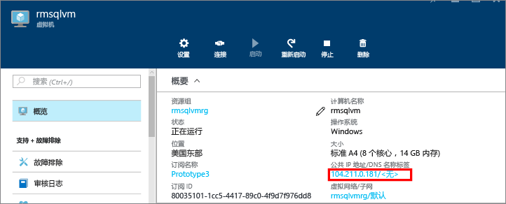
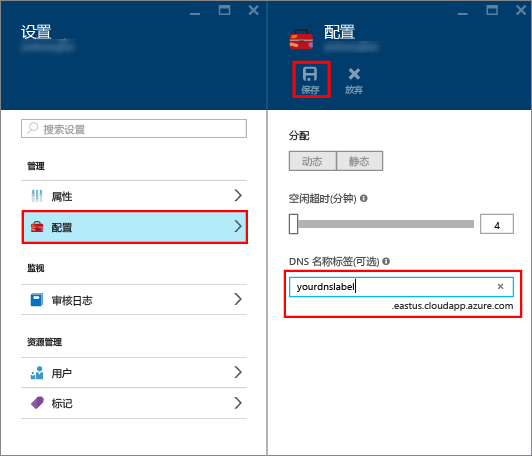
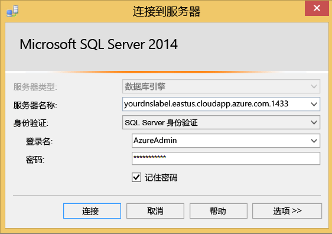

### 配置用于公共 IP 地址的 DNS 标签

若要从 Internet 连接到 SQL Server 数据库引擎，请考虑创建用于公共 IP 地址的 DNS 标签。 可以通过 IP 地址进行连接，但 DNS 标签可以创建更容易标识的 A 记录，并可抽象基础性公共 IP 地址。

> [!NOTE]
> 如果打算只连接到同一虚拟网络中的 SQL Server 实例，或者只进行本地连接，则 DNS 标签不是必需的。

若要创建 DNS 标签，请首先在门户中选择“虚拟机”  。 选择要显示其属性的 SQL Server VM。

1. 在虚拟机概览中，选择“公共 IP 地址”。

    

1. 在公共 IP 地址的属性中，展开“配置” 。

1. 输入 DNS 标签名称。 此名称是一种可通过名称而非 IP 地址直接连接到 SQL Server VM 的 A 记录。

1. 单击“保存”按钮  。

    

### 从其他计算机连接到数据库引擎

1. 在连接到 Internet 的计算机上，打开 SQL Server Management Studio (SSMS)。 如果没有 SQL Server Management Studio，可以从[此处](https://docs.microsoft.com/sql/ssms/download-sql-server-management-studio-ssms)下载。

1. 在“连接到服务器”或“连接到数据库引擎”对话框中，编辑“服务器名称”值。 输入虚拟机的 IP 地址或完整 DNS 名称（已在上一个任务中确定）。 也可添加逗号并提供 SQL Server 的 TCP 端口。 例如，`mysqlvmlabel.eastus.cloudapp.azure.com,1433`。

1. 在“身份验证”框中，选择“SQL Server 身份验证”。

1. 在“登录”  框中，键入有效 SQL 登录的名称。

1. 在“密码”  框中，键入登录的密码。

1. 单击“连接”。

    