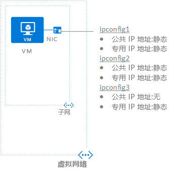

## 场景
创建具有单个 NIC 的 VM 并将其连接到虚拟网络。 VM 需要三个不同的专用  IP 地址和两个公共  IP 地址。 IP 地址将分配到以下 IP 配置：

* **IPConfig-1：** 分配一个静态  专用 IP 地址和一个静态  公共 IP 地址。
* **IPConfig-2：** 分配一个静态  专用 IP 地址和一个静态  公共 IP 地址。
* **IPConfig-3：** 分配一个静态  专用 IP 地址，不分配公共 IP 地址。
  
    

创建 NIC 时，IP 配置将关联到 NIC；创建 VM 时，NIC 将附加到 VM。 本方案使用的 IP 地址类型用于演示。 可以根据需要分配任何 IP 地址和指定分配类型。

> [!NOTE]
> 尽管本文是将所有 IP 配置分配到单个 NIC，但也可以将多个 IP 配置分配到具有多个 NIC 的 VM 中的任意 NIC。 若要了解如何创建具有多个 NIC 的 VM，请阅读[创建具有多个 NIC 的 VM](../articles/virtual-machines/windows/multiple-nics.md)一文。