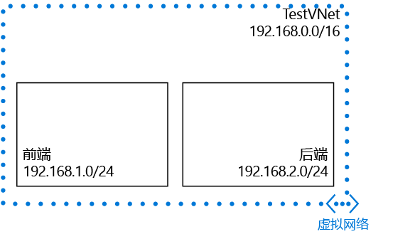

## 场景

为了说明如何创建 VNet 和子网，本文档使用以下方案：

在此方案中，将创建名为 **TestVNet** 的 VNet，其中有保留 CIDR 块 **192.168.0.0./16**。 该 VNet 包含以下子网： 

* **FrontEnd**，使用 **192.168.1.0/24** 作为其 CIDR 块。
* **BackEnd**，使用 **192.168.2.0/24** 作为其 CIDR 块。

