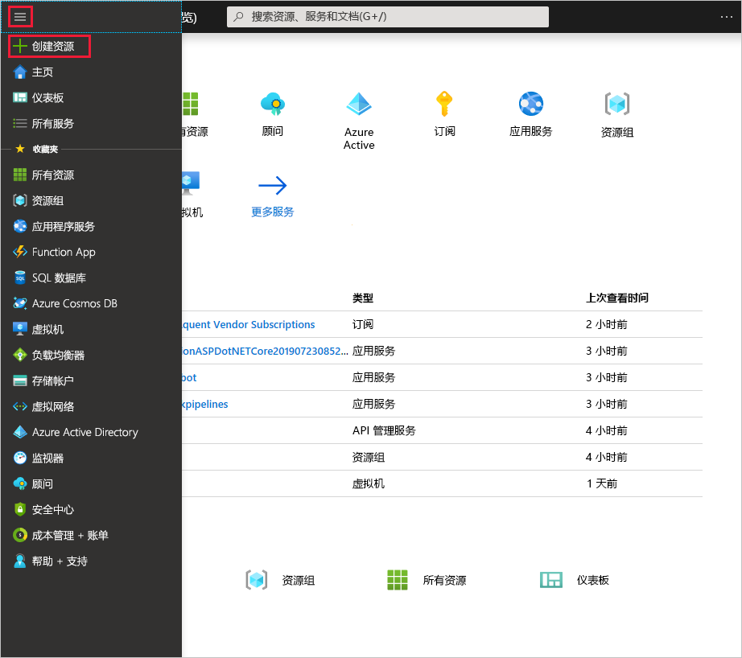
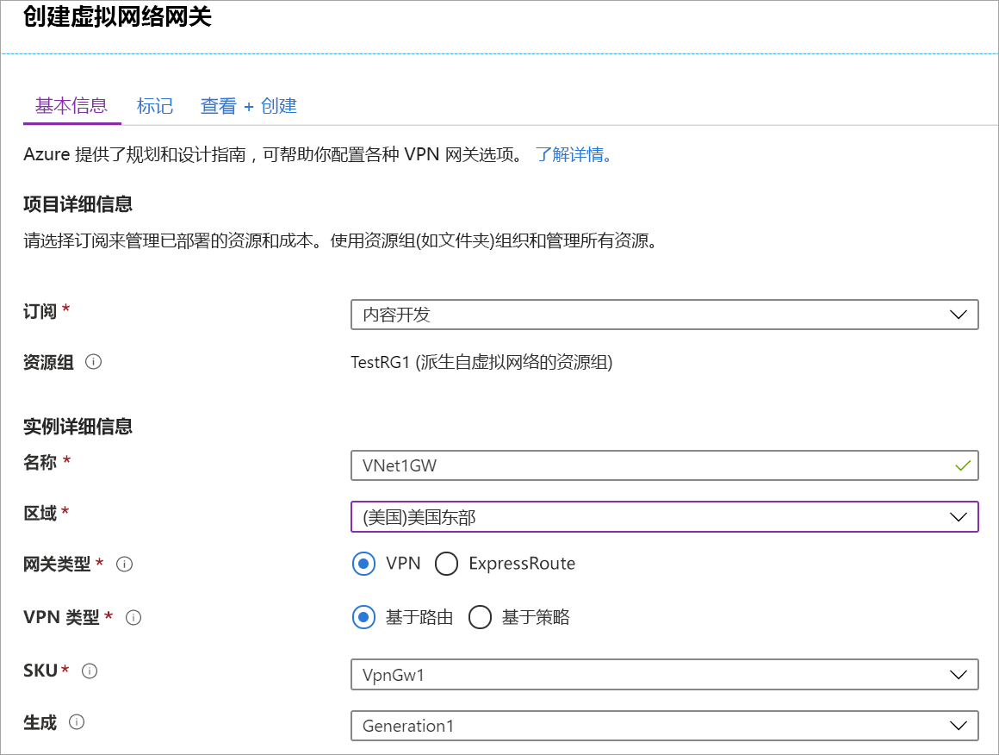
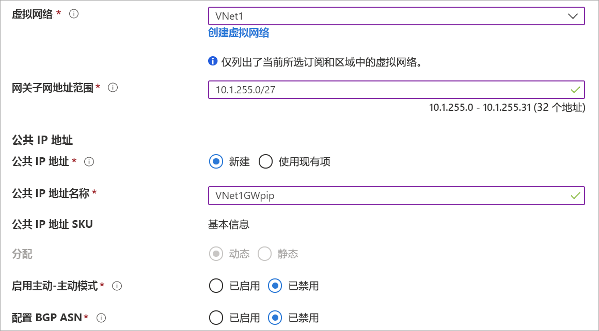

1. 在[Azure 门户](https://portal.azure.com)菜单中，选择 **"创建资源**"。 

   
2. 在 **"搜索市场"** 字段中，键入"虚拟网络网关"。 在搜索返回中查找**虚拟网络网关**并选择条目。 在**虚拟网络网关**页上，选择 **"创建**"。 这会打开“创建虚拟网关”页****。
3. 在 **"基本"** 选项卡上，填写虚拟网络网关的值。

   

   

   **项目详情**

   - **订阅**：从下拉列表中选择要使用的订阅。
   - **资源组**：当您在此页面上选择虚拟网络时，此设置将自动填充。

   **实例详细信息**

   - **名称**：为网关命名。 为网关命名与为网关子网命名不同。 它是要创建的网关对象的名称。
   - **区域**：选择要在其中创建此资源的区域。 网关的区域必须与虚拟网络相同。
   - **网关类型**：选择“VPN”****。 VPN 网关使用虚拟网络网关类型“VPN”****。
   - **VPN 类型**：选择为配置指定的 VPN 类型。 大多数配置要求基于路由的 VPN 类型。
   - **SKU**：从下拉列表中选择网关 SKU。 下拉列表中列出的 SKU 取决于选择的 VPN 类型。 有关网关 SKU 的详细信息，请参阅[网关 SKU](../articles/vpn-gateway/vpn-gateway-about-vpn-gateway-settings.md#gwsku)。
   - **生成**： 有关 VPN 网关生成的信息，请参阅[网关 SKU](../articles/vpn-gateway/vpn-gateway-about-vpngateways.md#gwsku)。
   - **虚拟网络**：从下拉列表中，选择要向其添加此网关的虚拟网络。
   - **网关子网地址范围**：此字段仅在 VNet 没有网关子网时才出现。 如果可能，使范围 /27 或更大 （/26，/25 等）。 我们不建议创建小于 /28 的范围。 如果您已有网关子网，则可以通过导航到虚拟网络来查看网关子网详细信息。 单击**子网**以查看范围。 如果要更改范围，可以删除并重新创建 Gateway Subnet。

   **公共 IP 地址**：此设置指定与 VPN 网关关联的公共 IP 地址对象。 创建 VPN 网关后，会将公共 IP 地址动态分配给此对象。 公共 IP 地址只在删除或重新创建网关时更改。 该地址不会因为 VPN 网关大小调整、重置或其他内部维护/升级而更改。

     - **公共 IP 地址**：保留 **"创建新**选择"。
     - **公共 IP 地址名称**：在文本框中，键入公共 IP 地址实例的名称。
     - **分配**： VPN 网关仅支持动态。

   **活动-活动模式**：仅在创建主动-活动网关配置时选择**启用活动-活动模式**。 否则，请将此设置保留未选择状态。

   让“配置 BGP ASN”保留**** 取消选中状态，除非你的配置特别需要此设置。 如果确实需要此设置，则默认 ASN 为 65515，但可以更改此值。
4. 选择 **"查看 + 创建**"以运行验证。 验证通过后，选择 **"创建**"以部署 VPN 网关。 网关可能需要长达 45 分钟才能完全创建和部署。 可以在网关的“概述”页上查看部署状态。

创建网关后，可以通过在门户中查看虚拟网络，来查看已分配给网关的 IP 地址。 网关显示为连接的设备。
