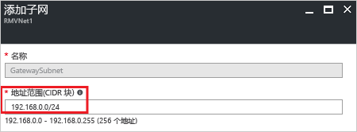

1. 在[Azure 门户](http://portal.azure.com)中，选择要为其创建虚拟网关的资源管理器虚拟网络。

2. 在虚拟网络页的“设置”部分中，选择“子网”展开“子网”页    。

3. 在“子网”页中，选择“网关子网”打开“添加子网”页    。

   

4. 子网的“名称”自动填充为值“GatewaySubnet”   。 Azure 需要此值才能识别作为网关子网的子网。 根据配置要求调整自动填充的“地址范围”值，然后选择“确定”以创建该子网   。

   