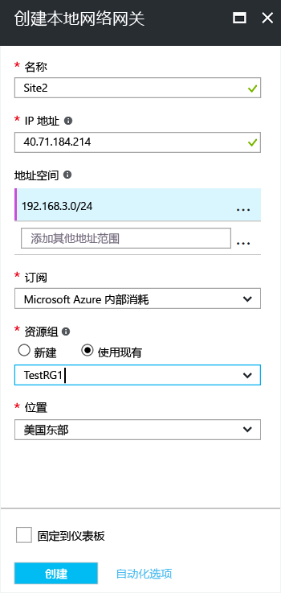

1. 在门户中，从“所有资源”单击“+添加”。 
2. 在“所有内容”页搜索框中键入“本地网络网关”，并单击进行搜索。 这会返回一个列表。 单击“本地网络网关”打开相应页，然后单击“创建”打开“创建本地网络网关”页。

  

3. 在“创建本地网络网关”页上，指定本地网络网关的值。

  - “名称”：指定本地网络网关对象的名称。
  - “IP 地址”：这是 Azure 要连接的 VPN 设备的公共 IP 地址。 指定有效的公共 IP 地址。 IP 地址不能位于 NAT 后面，并且必须可让 Azure 访问。 如果目前没有 IP 地址，可以使用屏幕截图中显示的值，但是需要返回并将占位符 IP 地址替换为 VPN 设备的公共 IP 地址。 否则，Azure 不能连接。
  - “地址空间”指的是此本地网络所代表的网络的地址范围。 可以添加多个地址空间范围。 请确保此处所指定的范围没有与要连接到的其他网络的范围相重叠。 Azure 会将指定的地址范围路由到本地 VPN 设备 IP 地址。 请在此处使用自己的值，而不是屏幕截图中显示的值。
  - **配置 BGP 设置：**仅在配置 BGP 时使用。 否则，不选择此项。
  - “订阅”：确保显示的是正确订阅。
  - “资源组”：选择要使用的资源组。 可以创建新的资源组或选择已创建的资源组。
  - “位置”：选择将在其中创建此对象的位置。 可选择 VNet 所在的位置，但这不是必须的。

4. 完成指定值后，单击页底部的“创建”即可创建本地网络网关。