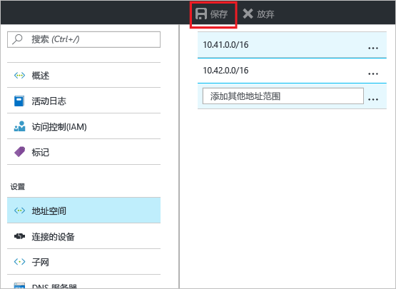
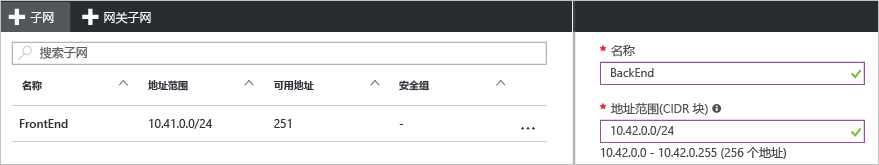

### 添加其他地址空间

1. 若要添加更多地址空间，请在虚拟网络页的“设置”部分单击“地址空间”，打开“地址空间”页。
2. 添加更多地址空间，然后单击页顶部的“保存”。

  

### 创建额外的子网

1. 若要创建子网，请在虚拟网络页的“设置”部分单击“子网”，打开“子网”页。 
2. 在“子网”页中，单击“+子网”打开“添加子网”页。 为新子网命名，并指定地址范围。

  
3. 若要保存所做的更改，请单击页面底部的“确定”。

  