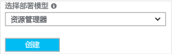

若要使用 Azure 门户在 Resource Manager 部署模型中创建 VNet，请执行以下步骤。 这些屏幕截图作为示例提供。 请务必替换成自己的值。 有关使用虚拟网络的详细信息，请参阅 [虚拟网络概述](../articles/virtual-network/virtual-networks-overview.md)。

>[!NOTE]
>为了让此 VNet 连接到本地位置，需与本地网络管理员协调操作，指定一个 IP 地址范围，将其专用于此虚拟网络。 如果 VPN 连接的两侧存在重复的地址范围，则流量不会按预期的方式路由。 另外，若要将此 VNet 连接到其他 VNet，则地址空间不能与其他 VNet 重叠。 请注意对网络配置进行相应的计划。
>
>

1. 从浏览器导航到 [Azure 门户](http://portal.azure.com)，并在必要时用 Azure 帐户登录。
2. 单击“+”。 在“搜索应用商店”字段中，键入“虚拟网络”。 从返回的列表中找到“虚拟网络”，单击打开“虚拟网络”页。

  
3. 从靠近“虚拟网络”页底部的“选择部署模型”列表中，选择“资源管理器”，然后单击“创建”。

  
4. 在“创建虚拟网络”页上，配置 VNet 设置。 填写字段时，如果在字段中输入的字符有效，红色感叹号标记会变成绿色对钩标记。 可能会有自动填充的值。 如果出现这种情况，将值替换为自己的值。 “创建虚拟网络”页看起来与以下示例类似：

  
5. “名称”：输入虚拟网络的名称。
6. **地址空间**：输入地址空间。 如果有多个要添加的地址空间，请添加第一个地址空间。 可在创建 VNet 后再添加其他地址空间。
7. **订阅**：确认列出的订阅是正确的。 可以使用下拉列表更改订阅。
8. **资源组**：选择现有的资源组，或键入新资源组的名称以创建新的资源组。 如果要创建新组，请根据计划的配置值来命名资源组。 有关资源组的详细信息，请访问 [Azure 资源管理器概述](../articles/azure-resource-manager/resource-group-overview.md#resource-groups)。
9. **位置**：选择 VNet 的位置。 该位置确定要部署到此 VNet 的资源所在的位置。
10. **子网**：添加子网名称和子网地址范围。 可在创建 VNet 后再添加其他子网。
11. 如果希望能够在仪表板上轻松查找 VNet，请选择“固定到仪表板”，并单击“创建”。

  