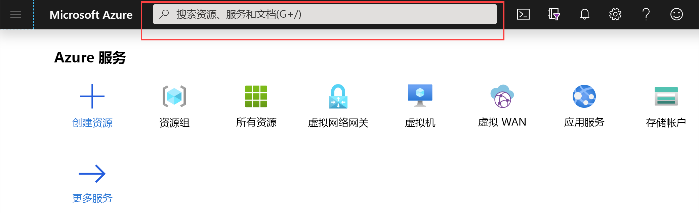
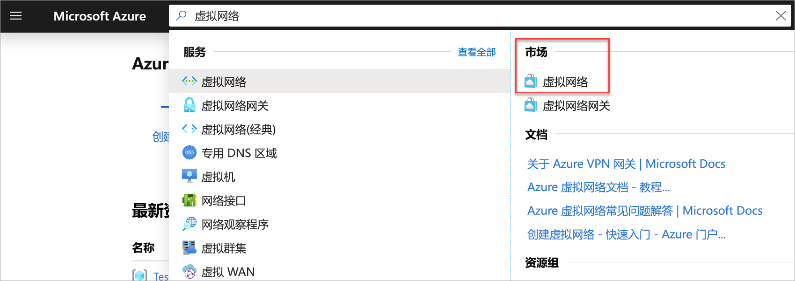
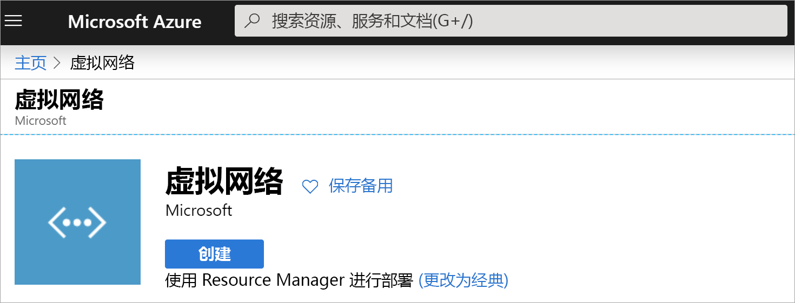
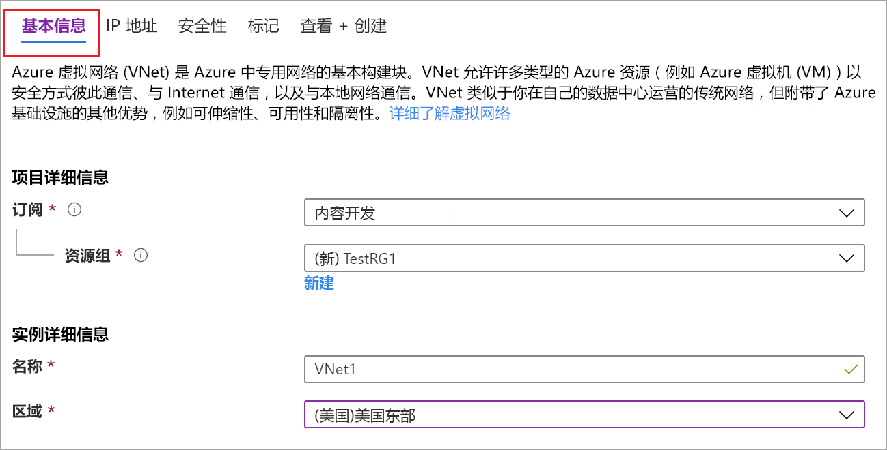
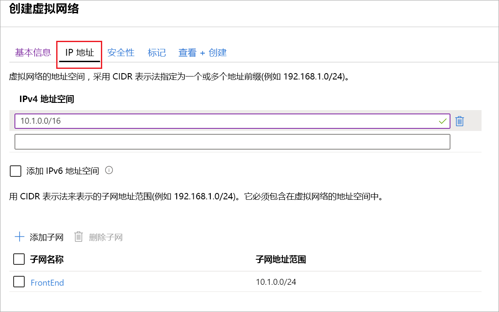

可以通过以下步骤使用资源管理器部署模型和 Azure 门户创建一个 VNet。 有关虚拟网络的详细信息，请参阅[虚拟网络概述](../articles/virtual-network/virtual-networks-overview.md)。

>[!NOTE]
>使用虚拟网络作为跨界体系结构的一部分时，请确保与本地网络管理员协调，以划分可用于此虚拟网络的 IP 地址范围。 如果 VPN 连接的两端存在重复的地址范围，则会以意外方式路由流量。 此外，如果你想要将此虚拟网络连接到另一个虚拟网络，则地址空间不能与其他虚拟网络重叠。 相应地规划网络配置。
>
>

1. 登录 [Azure 门户](https://portal.azure.com)。
1. 在**搜索资源、服务和文档（G +/）** 中，键入 "*虚拟网络*"。

   
1. 从**Marketplace**结果中选择 "**虚拟网络**"。

   
1. 在 "**虚拟网络**" 页上，选择 "**创建**"。

   
1. 选择 "**创建**" 后，将打开 "**创建虚拟网络**" 页。
1. 在 "**基本**信息" 选项卡上，配置**项目详细信息**和**实例详细信息**VNet 设置。

   填写字段时，会在验证字段中输入的字符时看到绿色复选标记。 某些值是自动填写的，你可以将其替换为自己的值：

   - “订阅”：确认列出的是正确的订阅。 可以使用下拉列表更改订阅。
   - **资源组**：选择现有资源组，或单击 "**新建**" 创建一个新的资源组。 有关资源组的详细信息，请参阅 [Azure 资源管理器概述](../articles/azure-resource-manager/management/overview.md#resource-groups)。
   - “名称”：输入虚拟网络的名称。
   - **区域**：选择 VNet 的位置。 该位置确定要部署到此 VNet 的资源将位于哪里。

1. 在 " **IP 地址**" 选项卡上，配置值。 下面的示例中所示的值用于演示目的。 根据所需的设置调整这些值。

     
   - **IPv4 地址空间**：默认情况下会自动创建地址空间。 你可以单击地址空间以调整它，以反映你自己的值。 还可以添加其他地址空间。
   - **IPv6**：如果你的配置需要 IPv6 地址空间，请选择 "**添加 ipv6 地址空间**" 框以输入该信息。
   - **子网**：如果使用默认的地址空间，则将自动创建默认子网。 如果更改地址空间，则需要添加一个子网。 选择 " **+ 添加子网**" 打开 "**添加子网**" 窗口。 配置以下设置，然后选择 "**添加**" 以添加值：
      - **子网名称**：在本示例中，我们将子网 "前端" 命名为。
      - **子网地址范围**：此子网的地址范围。

1. 此时，在 "**安全**" 选项卡上，保留默认值：

   - **DDos 保护**：基本
   - **防火墙**：已禁用
1. 选择 "**查看 + 创建**" 来验证虚拟网络设置。
1. 验证设置后，选择 "**创建**"。
