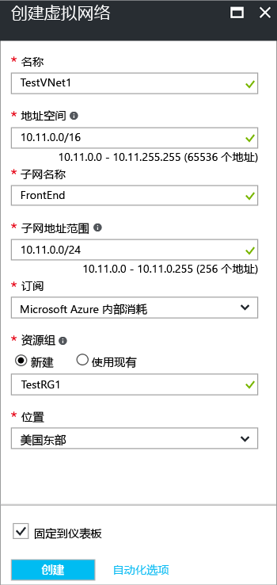

若要使用 Azure 门户，在资源管理器部署模型创建 VNet，请执行以下步骤。 使用[示例值](#values)如果作为教程，说明如何使用这些步骤。 如果你未作为教程，说明如何执行这些步骤，请务必将替换为你自己的值。 有关使用虚拟网络的详细信息，请参阅[虚拟网络概述](../articles/virtual-network/virtual-networks-overview.md)。

1. 从浏览器中，导航到[Azure 门户](http://portal.azure.com)并使用你的 Azure 帐户登录。
2. 单击“新建” 。 在**搜索 marketplace**字段中，键入虚拟网络。 找到**虚拟网络**从返回的列表并单击它以打开**虚拟网络**边栏选项卡。
3. 虚拟网络边栏选项卡，底部附近从**选择部署模型**列表中，选择**资源管理器**，然后单击**创建**。 这将打开创建虚拟网络边栏选项卡。

    
4. 上**创建虚拟网络**边栏选项卡，配置 VNet 设置。 当你填写字段时，红色感叹号将变为绿色的复选标记时在字段中输入字符都是有效。

  - **名称**： 输入你的虚拟网络的名称。 在此示例中，我们使用 TestVNet1。
  - **地址空间**： 输入的地址空间。 如果你有多个要添加的地址空间，添加你的第一个地址空间。 在创建 VNet 后，可以更高版本，添加其他地址空间。 请确保你指定的地址空间不与你的本地位置的地址空间重叠。
  - **子网名称**： 添加的第一个子网名称和子网地址范围。 你可以添加更多子网和网关子网更高版本，创建此 VNet 之后。 
  - **订阅**： 验证列出的订阅是否正确。 可以通过使用下拉列表来更改订阅。
  - **资源组**： 选择现有资源组，或创建一个新通过键入新的资源组的名称。 如果您正在创建新组，名称，根据你的计划的配置值的资源组。 有关资源组的详细信息，请访问[Azure 资源管理器概述](../articles/azure-resource-manager/resource-group-overview.md#resource-groups)。
  - **位置**： 选择你的 VNet 的位置。 位置确定你将部署到此 VNet 的资源将驻留的位置。

5. 选择**固定到仪表板**如果你想要能够轻松地在仪表板中，查找你的 VNet，然后单击**创建**。 单击后**创建**，你将在你将反映你的 VNet 的进度的仪表板上看到磁贴。 在创建 VNet 时，将更改磁贴。