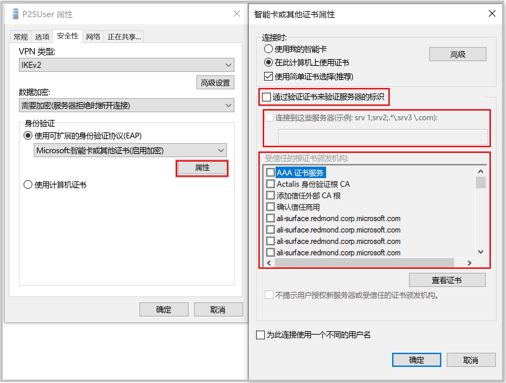

[!INCLUDE [P2S FAQ All](vpn-gateway-faq-p2s-all-include.md)]

### 如果在使用证书身份验证进行连接时收到指示证书不匹配的消息，我该怎么办？

取消选中“通过验证证书来验证服务器的标识”  ，或在手动创建配置文件时**将服务器 FQDN 随证书一起添加**。 为此，可以在命令提示符下运行 **rasphone**，并从下拉列表中选择配置文件。

通常不建议绕过服务器标识验证，但在使用 Azure 证书身份验证的情况下，会在 VPN 隧道协议 (IKEv2/SSTP) 和 EAP 协议中将同一证书用于服务器验证。 由于服务器证书和 FQDN 已通过 VPN 隧道协议进行验证，因此在 EAP 中再次验证同一证书就是多余的。

### 是否可以使用自己的内部 PKI 根 CA 来生成用于点到站点连接的证书？

是的。 以前只可使用自签名根证书。 仍可上传 20 个根证书。

### 是否可以使用 Azure 密钥保管库中的证书？

不是。

### 可以使用哪些工具来创建证书？

可以使用企业 PKI 解决方案（内部 PKI）、Azure PowerShell、MakeCert 和 OpenSSL。

### 是否有证书设置和参数的说明？

* **内部 PKI/企业 PKI 解决方案：** 请参阅[生成证书](../articles/vpn-gateway/vpn-gateway-howto-point-to-site-resource-manager-portal.md#generatecert)的步骤。

* **Azure PowerShell：** 请参阅 [Azure PowerShell](../articles/vpn-gateway/vpn-gateway-certificates-point-to-site.md) 一文了解相关步骤。

* **MakeCert：** 请参阅 [MakeCert](../articles/vpn-gateway/vpn-gateway-certificates-point-to-site-makecert.md) 一文了解相关步骤。

* **OpenSSL：** 

    * 导出证书时，请务必将根证书转换为 Base64。

    * 对于客户端证书：

      * 创建私钥时，请将长度指定为 4096。
      * 创建证书时，对于 *-extensions* 参数，指定 *usr_cert*。
